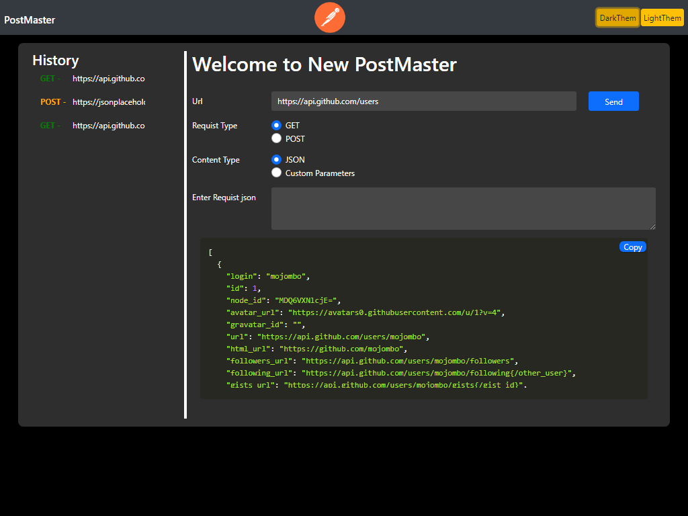
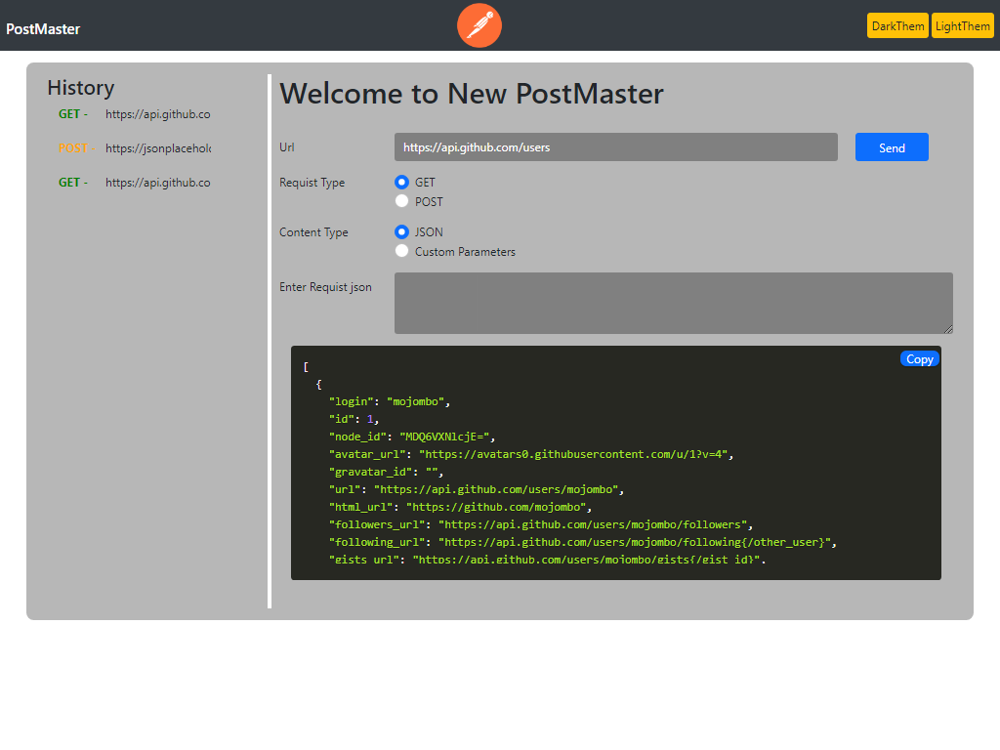
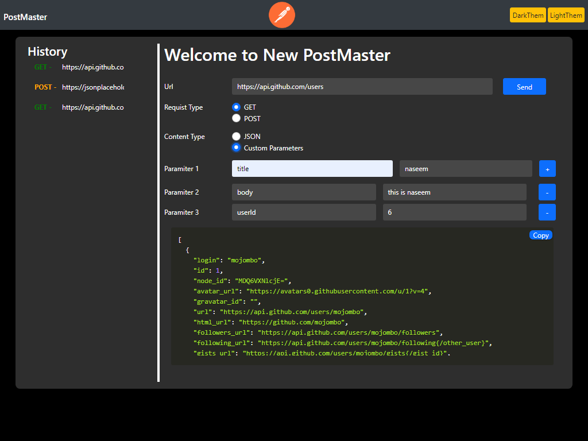
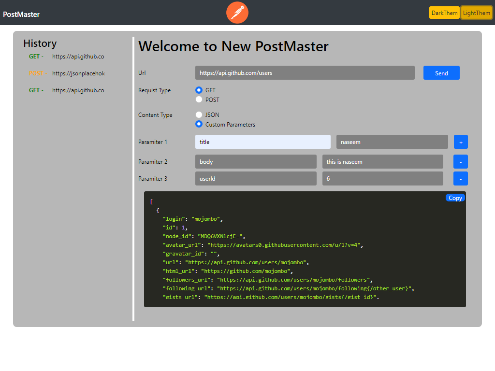

# New-PostMaster
using Html,BootsrapV5, vanilla JavaScript. Make best form validation using regular-ex

Dark Mode: 

**Copy Functionality :**

Dark Mode: 

**Using JavaScripte make light mode :**

Light Mode: 

Light Mode: 

# How It's work
Run the programe and salect requst type GET or POST and salect Contente Type JSON Or Custom parameter
